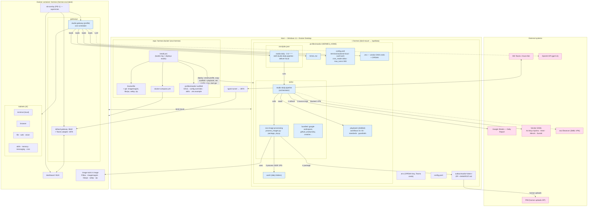

# Hermes install — architecture

Mermaid diagram of the evo-hermes Docker install: container, both gateways, the
`studio` profile (skills, cron, playbook), tools, and external systems.

Blue = studio profile components · pink = external systems. Two gateways run under
one s6 instance in a single container. The studio cron fires daily, runs the
`studio-daily-pipeline` skill, which reads the bundled playbook, sources from vendor
DAMs / Google Sheets, processes images to 1500² JPGs via `evo-image-processing`, zips
PIM-ready output to the outbox, and a human uploads the ZIP to PIM. Solid arrows =
work flow, dotted = LLM call / blocked human gate.

