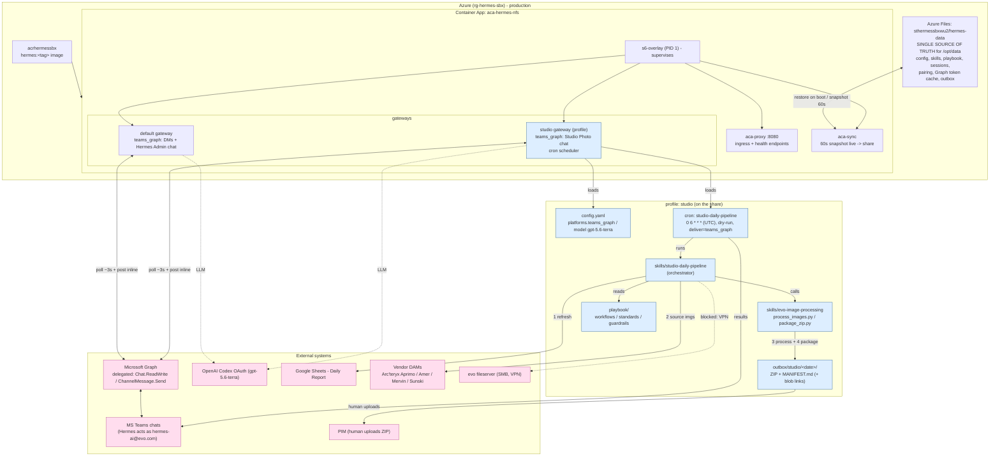

# Hermes install - architecture

Mermaid diagram of the evo-hermes deployment: one container (Azure Container Apps in
production, docker compose for local dev), two gateways, the `studio` profile, and
external systems.

Teams connectivity is the **teams_graph** adapter: Hermes polls and posts as the
licensed user `hermes-ai@evo.com` via delegated Microsoft Graph. Outbound HTTPS only —
no bot registration, no tunnel, no inbound webhook. Blue = studio profile components.
Pink = external systems. The studio cron fires daily at 06:00 UTC, runs the
`studio-daily-pipeline` skill, reads the playbook, sources from vendor DAMs / Google
Sheets, processes images to 1500x1500 JPGs via `evo-image-processing`, zips PIM-ready
output to the outbox, and delivers results to the "Studio Photo" group chat.

Local dev (`install.ps1` + docker compose) runs the same image with `~/.hermes`
bind-mounted as `/opt/data`. Because teams_graph polls outbound, a local instance can
chat on Teams with no tunnel — but never run local and ACA against the same chats or
the same data directory at once.

Retired: the Bot Framework / Teams-app path (Azure Bot registrations, ngrok tunnels,
`/api/messages` webhooks, app manifest). Scripts preserved in `archive/`.
